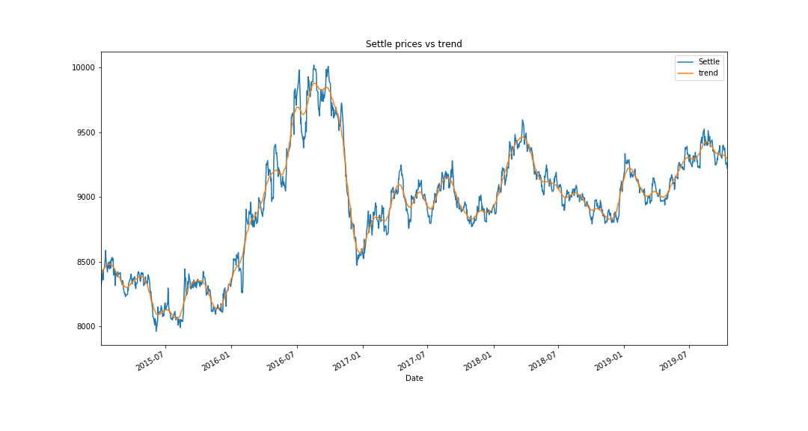

# A Yen for the future - Unit 10

Analysis code: [Notebook](https://github.com/jcurvone/timeseries_hw10/blob/master/timeseries_analysis.ipynb)

### Time-Series Forecasting 

HP Filter of the Yen settle price versus the US dollar 

ARMA Model Returns Forecasting Summary 

ARIMA Model Price Forecasting Summary 

GARCH Model Volatility Forecasting Summary 

###### Based on your time series analysis, would you buy the yen now?
I would not buy the YEN short term, but will buy once it dips. 
ARMA has a much lower AIC/BIC than ARIMA and as ARMA predicts a dip short term but a positive return at the end, I would wait to buy at the dip. 

###### Is the risk of the yen expected to increase or decrease?
Volatility is forecasted to significantly increase, therefore yes, risk is expected to increase. 

###### Based on the model evaluation, would you feel confident in using these models for trading?
I would not. R2 for the volatility is 0, so the dataset does not explain the volatility. 

### Linear Regression Forecasting 

**Out of sample RMSE: 0.414** 
**In sample RMSE: 0.625**

###### Does this model perform better or worse on out-of-sample data compared to in-sample data?
The model performs worse Out of sample, which is not a bad sign as it is expected for reliable models to have better RMSE results with in sample data.